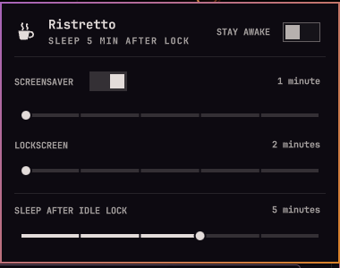

# Ristretto

An [Omarchy](https://omarchy.org) shell plugin that gives you direct control
over power-saver behaviour, from the bar: **when the screensaver starts, when
the session locks, and when the machine suspends.**



Omarchy has no suspend-on-idle of any kind — under a Wayland compositor,
logind's `IdleAction` never fires because nothing publishes idle state to it.
Ristretto adds it at the only workable layer, the shell: a delay that starts
counting when the session locks *because you went idle*, and suspends the
machine when it runs out. A lock you trigger yourself — a keybinding, the
menu, or `omarchy lock` — never leads to suspend.

## What it does

- **Screensaver delay** — how long after going idle the screensaver appears:
  1, 2, 3, 5, 10 or 15 minutes.
- **Lockscreen delay** — how long after going idle the session locks:
  2, 3, 5, 10, 15 or 30 minutes. Always strictly above the screensaver delay;
  moving either slider nudges the other when they would collide.
- **Sleep after idle lock** — how long after an idle-driven lock the machine
  suspends: 1, 2, 3, 5 or 10 minutes, or never. A pending countdown is
  cancelled by unlocking, by changing the delay, or by switching stay awake
  on — anything that says "not now" means not now.
- **Screensaver switch** — Omarchy's native `screensaver-off` flag, which has
  a CLI (`omarchy toggle screensaver`) but no other UI.
- **Stay awake switch** — the native `omarchy.idle` stay-awake state as a
  labelled control. While it is on, no idle cycle runs: no screensaver, no
  lock, no sleep — and the cup in the bar steams, so the state is readable
  at a glance without opening the panel.

Everything reads and writes Omarchy's own config and services, so changes
take effect immediately, survive a shell restart and `omarchy update`, and
stay in sync with their CLI equivalents in both directions.

## Requirements

Everything Ristretto needs ships with Omarchy itself — there are no
third-party dependencies.

- **Omarchy 4.0.1 or later (Quickshell 0.3.1).** The plugin binds the
  first-party `omarchy.idle` and `omarchy.lock` shell services and builds
  its UI from the shell's own component kit. If either service is
  disabled, Ristretto degrades gracefully: the panel still renders and the
  suspend timer simply never arms.
- **systemd-logind** for the suspend itself — `systemctl suspend` from the
  active session, no root and no polkit prompt.

## Install

```bash
omarchy plugin add https://github.com/HalmyLyseas/omarchy-ristretto --enable
```

The cup appears in the bar's right section. Installing changes nothing about
what your machine does: the suspend delay ships as *never* until you pick a
value.

## Usage

Click the cup (or run `omarchy-shell halmylyseas.ristretto open`) to open the
panel. Everything is also reachable from the keyboard: arrows or `hjkl` move
a cursor between controls, `Left`/`Right` nudge the focused slider, `Space`
or `Enter` flip a switch, `Esc` closes.

The hero subtitle states what the machine will actually do — `SLEEP 5 MIN
AFTER LOCK`, `SLEEP NEVER`, or `STAYING AWAKE` — so the armed behaviour is
readable at a glance.

One caveat worth knowing: video players and browsers that implement the
Wayland idle-inhibit protocol pause the whole idle pipeline while they
play, but not every app does — Zoom's Linux client, for one, does not, so
a long hands-off call will idle, lock, and eventually sleep. That is what
the stay awake switch is for; the steaming cup reminds you it is on.

## Configuration

The panel is the intended interface, but everything it writes lands in plain
config you can edit or script. The delays live in `~/.config/omarchy/shell.json`
under `idle` (seconds — shared with Omarchy itself):

```json
"idle": { "screensaver": 180, "lock": 300 }
```

Hand-edited values are respected, not repaired: the panel approximates an
off-scale value on its sliders without writing anything back, and if an
edit leaves the lock delay at or below the screensaver delay, the panel
shows a warning — moving either slider fixes the pair.

Ristretto's own settings live in its bar-layout entry in the same file:

| Key | Default | Meaning |
|---|---|---|
| `sleepAfterIdleLock` | `-1` | Seconds between an idle lock and suspend. Accepted range is 60 seconds to 24 hours (86400); anything below 60 or non-numeric means never, and anything above 24 hours is clamped down to it. `-1` (or any value under 60) means never. |
| `dryRun` | `false` | When set to `true` (accepted spellings: `true`, `"true"`, `1`, `"1"`), replaces the real suspend with a journal line and a notification, and the panel shows a `DRY RUN` badge. Every other value, including an unset key, means off. Config-only; meant for testing timing without suspending the machine. |

```bash
# set a value from the CLI
omarchy-shell shell setBarWidget halmylyseas.ristretto sleepAfterIdleLock 300 '{}'
```

The service logs every decision to the journal, prefixed `ristretto`:

```bash
journalctl --user -f | grep "qml: ristretto"
```

## Removal

```bash
omarchy plugin remove halmylyseas.ristretto
```

This disables the plugin and deletes its folder. Note that disabling (or
removing) splices the plugin's entry out of `shell.json`, so its settings —
the sleep delay included — do not survive a disable/enable cycle; the `idle`
delays are Omarchy's own and are left as you set them.

## Verify

```bash
bash test/all               # unit, host-contract, hygiene, sinks, and both qs probes
omarchy plugin validate .    # manifest + security-baseline checks
```

`bash test/all`'s unit and hygiene suites need only plain Node; the two
`qs`-driven probes and the host-contract check skip themselves cleanly
when there's no live shell tree or Quickshell session to run against.

## Developing

Design decisions, host-API traps, and the testing workflow are in
[docs/developers.md](docs/developers.md).

## Licence

[MIT](LICENSE)
